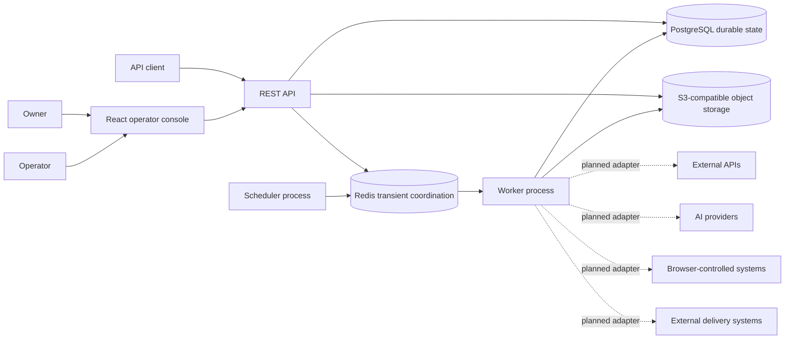
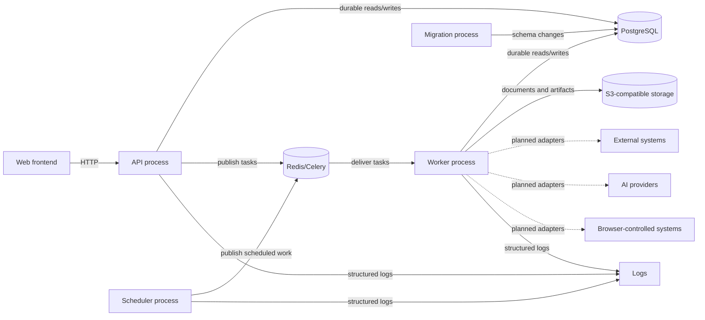
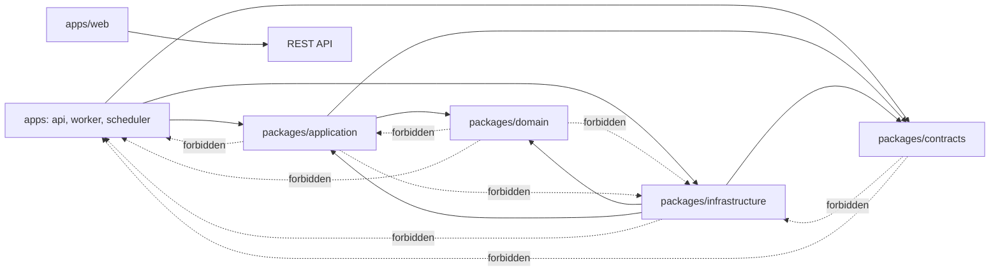

# Architecture

This document defines the high-level WorkflowForge architecture for the implemented Phase 1 and Phase 2 foundations and the planned V1 system.

## Architecture Summary

WorkflowForge is designed as a modular monolith: one repository, one coordinated product, multiple independently runnable processes, and explicit internal package boundaries.

The V1 architecture uses PostgreSQL as the durable source of truth for workflow and identity state, Redis for queues, locks, caching, heartbeats, rate limits, and transient coordination, and S3-compatible object storage for documents and artifacts. External and frontend communication goes through a REST API. Background workers execute asynchronous work, a scheduler process publishes periodic work, and a React operator console supports human operation.

Docker Compose is the local development environment for running the API, worker, scheduler, web frontend, PostgreSQL, Redis, MinIO, and migrations together.

Separate API, worker, scheduler, and web processes do not make WorkflowForge microservices. They are runtime processes inside one modular monolith with coordinated releases and shared internal packages.

## Architectural Goals

- Reliable execution with durable state.
- Explicit state transitions for workflows, executions, steps, attempts, reviews, and results.
- Recoverable failures with bounded retries and visible error history.
- Testable business logic outside framework entry points.
- Replaceable infrastructure adapters behind ports.
- Observable operations across API, worker, scheduler, and dependencies.
- Predictable dependency direction.
- Strong local development experience.
- Production-relevant design without premature distributed systems.

## System Context

WorkflowForge is used by owners who configure workflows and access, operators who monitor and review executions, and API clients that submit inputs or consume results. Documents and files enter the system as workflow inputs and artifacts.

Planned external dependencies include external APIs, browser-controlled systems, AI providers, and delivery systems. Most external adapters are planned for later phases.

PostgreSQL stores durable product state. Redis supports transient coordination and queue transport. S3-compatible object storage holds documents and large artifacts.



## Process Architecture

### API

The API process owns HTTP transport concerns: routing, request parsing, response mapping, dependency injection, authentication transport, exception mapping, middleware, lifecycle management, and publication of asynchronous work.

It must not own domain rules, infrastructure implementations, worker task bodies, or frontend state. The API invokes application use cases and composes them with infrastructure adapters.

Communication: HTTP from clients and the web frontend, PostgreSQL for durable reads and writes through repositories, Redis/Celery for task publication, and object storage through ports where required.

Durable state must be persisted in PostgreSQL before work is published. Request-local state is transient.

### Worker

The worker process owns background task execution, task registration, application use-case invocation, worker lifecycle, task-level logging, and correlation propagation.

It must not duplicate business logic from `packages/application` or invent durable workflow state outside PostgreSQL.

Communication: consumes queued work from Redis/Celery, uses PostgreSQL for durable execution state, object storage for documents and artifacts, and planned adapters for AI providers, browser automation, external APIs, and delivery systems.

Durable workflow outcomes are recorded in PostgreSQL. Queue messages, locks, and worker heartbeat data are transient.

### Scheduler

The scheduler process owns periodic task definitions, delayed work publication, scheduler lifecycle, and time-based coordination.

It must not execute business workflows directly and must not become the durable owner of scheduled workflow state.

Communication: publishes scheduled work to Redis/Celery and may read durable scheduling intent from PostgreSQL through application use cases.

Durable scheduling decisions belong in PostgreSQL. Heartbeats and transient scheduling coordination may live in Redis.

### Web Frontend

The web frontend owns the React application, routing, TanStack Query usage, API client, operator-facing UI, frontend-only state, and presentation logic.

It must not become a second source of business truth. Business decisions and durable state belong in backend packages and PostgreSQL.

Communication: calls the REST API and renders API responses. Browser state is transient unless persisted through API use cases.

### PostgreSQL

PostgreSQL owns durable product state: workflow definitions, workflow versions, executions, step attempts, review decisions, results, audit records, integration configuration metadata, and document metadata.

It must not be bypassed by Redis or local files for durable workflow state.

### Redis

Redis supports Celery broker messages, caches, locks, rate-limit coordination, scheduler heartbeat, worker heartbeat, and temporary coordination data.

Redis is not the source of truth for workflow state.

### MinIO Locally

MinIO is the planned local S3-compatible object storage service for uploaded documents, extracted artifacts, screenshots, generated reports, and large result files.

Object storage owns file-like data, not workflow state transitions.

### Migration Process

The migration process owns schema migration execution against PostgreSQL.

It must not run as an uncontrolled side effect of every API or worker startup. Application startup must not race multiple migration attempts.

## Container Communication



## Package Architecture

```text
apps/
|-- api/
|-- worker/
|-- scheduler/
`-- web/

packages/
|-- domain/
|-- application/
|-- contracts/
`-- infrastructure/
```

### `packages/domain`

Contains domain entities, value objects, domain services, domain rules, domain errors, and state transition rules.

It must not depend on FastAPI, SQLAlchemy, Celery, Redis, boto3, browser tooling, AI SDKs, `packages/application`, `packages/infrastructure`, or app composition roots.

### `packages/application`

Contains use cases, orchestration, commands and queries, application services, transaction boundaries, coordination through ports, and authorization decisions where appropriate.

It may depend on `packages/domain` and `packages/contracts`. It must not depend directly on `packages/infrastructure`, FastAPI routes, Celery runtime details, React, or specific provider SDKs.

### `packages/contracts`

Contains stable shared boundaries: ports, commands, events, task payloads, transport-neutral DTOs, structured result contracts, provider-neutral interfaces, and integration-neutral schemas.

It must not become a dump for every Pydantic model. HTTP-specific schemas belong in `apps/api`. Database models belong in `packages/infrastructure`. Frontend types belong in `apps/web` unless they are later generated from stable API contracts.

### `packages/infrastructure`

Contains adapters for PostgreSQL, Redis, S3-compatible storage, Celery, AI providers, browser automation, external APIs, reports, logging, and observability integrations.

It implements ports defined by inner layers. It must not contain product use cases or HTTP route logic.

### `apps/api`

Composition root for FastAPI, HTTP routing, request parsing, response mapping, dependency injection, authentication transport, exception mapping, API middleware, and lifecycle management.

### `apps/worker`

Composition root for Celery worker startup, task registration, application use-case invocation, worker lifecycle, and task-level logging and correlation.

It must not duplicate business logic from the application layer.

### `apps/scheduler`

Composition root for Celery Beat or an equivalent scheduler, periodic task definitions, scheduler lifecycle, and publication of scheduled work.

It must not execute business workflows directly.

### `apps/web`

Contains the React application, routing, TanStack Query, API client, operator-facing UI, frontend-only state, and presentation logic.

It must not become a second source of business truth.

## Dependency Rules

Composition roots are allowed to depend on both application and infrastructure because they wire implementations to ports. Packages must not depend on apps.

```text
apps/api      ----\
apps/worker   ----+--> application ---> domain
apps/scheduler ---/          |
                             +--> contracts

infrastructure -------------> domain
infrastructure -------------> contracts
infrastructure -------------> application

domain -X-> application
domain -X-> infrastructure
application -X-> infrastructure
contracts -X-> infrastructure
packages -X-> apps
```



## Hexagonal Architecture

WorkflowForge uses ports and adapters to keep business use cases separate from infrastructure details.

Examples:

- An object storage port can be implemented by an S3-compatible adapter.
- A task queue port can be implemented by a Celery adapter.
- An AI provider port can be implemented by OpenAI, Anthropic, or mock adapters.
- A browser automation port can be implemented by a Playwright adapter.
- Database repositories can be implemented with SQLAlchemy.
- External API integrations can be implemented as adapters behind integration-neutral ports.

The practical rule is simple: inner layers describe what they need; infrastructure decides how to talk to concrete systems.

## Domain-Driven Design Usage

WorkflowForge uses DDD selectively where the product behavior deserves it: workflow lifecycle, execution state, step attempts, approvals, versioning, retries, idempotency, and audit semantics.

DDD should not be forced around logging, configuration, framework setup, simple data transport, or trivial CRUD. Bounded contexts or modules will be introduced only when actual product behavior supports them.

## Data Ownership and State

### Durable State

Durable state lives in PostgreSQL:

- Workflows.
- Workflow versions.
- Executions.
- Step attempts.
- Review decisions.
- Results.
- Audit records.
- Integration configuration metadata.
- Document metadata.

### Object State

Object state lives in S3-compatible object storage:

- Uploaded documents.
- Extracted artifacts.
- Screenshots.
- Generated reports.
- Large result files.

### Transient State

Transient state may live in Redis:

- Celery broker messages.
- Caches.
- Locks.
- Rate-limit coordination.
- Scheduler heartbeat.
- Worker heartbeat.
- Temporary coordination data.

Redis is not the source of truth for workflow state.

## API Architecture

WorkflowForge V1 is built around a REST API. Product routes are versioned under `/api/v1`, while operational health routes live outside product versioning.

The API should use clear request and response schemas, invoke API-neutral application use cases, return a consistent error shape, propagate correlation IDs, and later define pagination conventions. Relevant mutations should support idempotency where retrying client requests could otherwise create duplicate side effects.

Phase-specific endpoint catalogues live in the process and feature README files.

Tenant-scoped Phase 2 routes use organization route parameters such as `/api/v1/organizations/{organization_id}/...`. The API resolves tenant context server-side from the authenticated user, active organization, active membership, and code-defined permission map. Organization IDs from arbitrary request bodies are not trusted as tenant context.

Tenant context resolution lives in the application authorization boundary. The
API composes repositories for the selected route organization and authenticated
principal, then passes an immutable `TenantContext` to permission dependencies
and future tenant-scoped use cases. Permission checks use the code-defined
`Permission` enum and centralized role mapping rather than route-local strings
or client-provided roles.

Authentication transport remains an API concern: bearer access-token parsing, refresh-cookie handling, CSRF and Origin checks for cookie-authenticated state-changing endpoints, response cookies, and exception mapping belong in `apps/api`. Identity, session, authorization, tenant, and audit behavior should be exposed to the API through application use cases and ports.

The Phase 2 authentication API composes the identity lifecycle use cases with
SQLAlchemy repositories, token adapters, and a request-scoped transaction
manager in `apps/api`. The API sets and clears refresh/CSRF cookies only after
state-changing application use cases return or intentionally committed replay
revocation has been reported. Login and refresh endpoints use Redis-backed
rate limiting through infrastructure adapters.

## Background Execution

The API creates durable intent in PostgreSQL before publishing asynchronous work. Celery transports work to workers. Workers invoke application use cases, and business state is persisted in PostgreSQL.

Retries must be explicit and bounded. Tasks must be idempotent where retries are possible. Task publication failures must be observable. The scheduler publishes work but does not own durable workflow state. Dead-letter handling is planned for execution phases.

## Document Domain And Storage Foundation

Phase 3 Step 2 makes `Document` a tenant-owned aggregate root. It stores document identity, `organization_id`, display filename, source type and optional source reference, operational status, current-version reference, archive metadata, actor metadata, timestamps, and an optimistic `lock_version`.

Binary metadata belongs to immutable `DocumentVersion` rows. Each version stores the original filename, media type, byte size, lowercase SHA-256 content hash, object-storage key, storage state (`pending`, `stored`, or `failed`), version number, creator, and creation timestamp. Version numbers start at `1` and are unique per document. Current-version changes mutate only the document aggregate pointer and lock version; version content is not edited in place.

`DocumentArtifact` records represent real stored objects derived from or associated with a document. Artifacts are tenant/document-owned, may reference a specific version, and store artifact type, media type, byte size, optional hash, object key, bounded JSON metadata, creator, and timestamp. Step 2 does not create placeholder artifacts and does not implement extraction, previews, OCR, exports, review, approval, or AI providers.

Exact duplicate detection is tenant-scoped. `document_versions` enforces unique `(organization_id, content_hash)` and `(organization_id, storage_object_key)`. The approved policy is that the same bytes in one tenant return the existing document resource, while the same bytes in different tenants do not conflict.

Final document binary keys are deterministic and tenant-safe:

```text
documents/{organization_id}/sha256/{first_2}/{next_2}/{full_hash}
```

Reserved layouts for later steps are:

```text
tmp/{organization_id}/{upload_id}
artifacts/{organization_id}/{document_id}/{artifact_type}/{artifact_id}
```

Object keys are internal implementation details, contain no user filename, and are validated as path-safe segments. Step 2 adds an application `ObjectStorage` port and S3-compatible adapter foundation for temporary writes, copy-plus-delete promotion, object head, delete, and download URL creation. It does not connect those operations to HTTP upload endpoints.

PostgreSQL and object storage are separate systems. Step 2 records storage state so future upload orchestration can register metadata, perform storage work, then mark success or failure without pretending there is a distributed transaction. S3-compatible promotion is copy plus delete, not atomic rename.

Phase 3 Step 3 adds the backend upload pipeline at
`POST /api/v1/organizations/{organization_id}/documents`. The route accepts one
multipart `file`, requires an `Idempotency-Key` header, resolves tenant context
from the authenticated principal, and invokes the application upload use case.
The response exposes safe document/current-version metadata and outcome flags
only; object keys, temporary keys, signed URLs, audit internals, and storage
implementation details stay server-side.

Upload validation is bounded to 50 MiB and supports exactly PDF, PNG, JPEG, TXT,
HTML, and DOCX with matching filename extension and declared media type. The
application streams upload bytes into a bounded temporary file while computing
the SHA-256 hash from the actual bytes. Signature and structure checks reject
unsupported extensions, media-type mismatches, empty files, oversized files,
malformed content, and unsafe DOCX archives. DOCX is treated as a constrained
Office document package, not arbitrary ZIP support.

Upload idempotency is durable in PostgreSQL through `upload_idempotency`, scoped
by `(organization_id, idempotency_key)`, with `in_progress`, `completed`, and
`failed` states and a default 24-hour expiry window. The final request
fingerprint includes the computed content hash, normalized filename, media type,
and byte size. Reusing the same key with the same completed request replays the
stored result; reusing it with different content or normalized metadata returns
`409 idempotency_conflict`; concurrent in-progress use returns
`409 idempotency_in_progress`. Non-retryable validation failures remain
replayable as stable `422` failures, while retryable storage failures may be
claimed again without deleting idempotency rows during the request.

The upload path writes only temporary objects under
`tmp/{organization_id}/{upload_id}` before duplicate detection and promotion.
New content is promoted to the deterministic final document key. Tenant-scoped
exact duplicates delete the temporary object, return the existing document with
`200 duplicate`, and do not promote another object. Storage failures leave
durable failed document/version or idempotency state where applicable and map to
`503 object_storage_unavailable`.

Step 3 also records upload-specific audit events:
`document.upload_started`, `document.storage_succeeded`,
`document.upload_failed`, and `document.duplicate_detected`. Audit metadata is
safe and bounded. This step still excludes frontend upload UI, signed download
API, batches, cases, workflow execution, extraction, OCR, classification, review,
approval, AI, malware scanning, and request-time cleanup of expired
idempotency rows.

## Identity, Tenancy, Authorization, And Audit Foundation

Phase 2 identity and tenancy work implements short-lived JWT access tokens, opaque rotating refresh tokens, durable sessions, organization-scoped routes, explicit tenant context, code-defined roles and permissions, tenant-aware repositories, and append-only audit records.

The access JWT contains only `sub`, `sid`, `jti`, `iat`, `exp`, `iss`, and `aud`. Organization IDs, roles, permissions, email addresses, secrets, and token material are resolved server-side rather than stored in JWT claims. The React frontend keeps access tokens in memory and receives refresh tokens through HttpOnly cookies. Future CLI, Telegram linking, and API-key flows should resolve to the same server-side identity and authorization model rather than bypass it.

Tenant-owned use cases receive an explicit `TenantContext` containing `user_id`, `organization_id`, `membership_id`, `role`, and `permissions`. Tenant-owned persistence uses organization foreign keys, tenant-scoped repository interfaces, composite tenant-aware uniqueness constraints, and indexes beginning with `organization_id` where appropriate. PostgreSQL row-level security is deferred until tenant tables and operational patterns stabilize; strict repository enforcement is the Phase 2 baseline.

Roles are `owner`, `admin`, `operator`, `reviewer`, and `auditor`. Permission mappings are code-defined, while membership stores the selected role. The last active owner cannot be removed, suspended, or demoted. Admins cannot create, promote, demote, suspend, update, or remove owners.

Audit records are append-only through application behavior and include tenant-aware context where available. Audit metadata is bounded and must not contain secret or token material. Security-state successes audit in the same transaction as the state change, while failures and denials use an independent audit transaction so they survive failed requests. Tenant-scoped audit queries require authorization, while global events are handled deliberately.

The identity persistence foundation stores users, organizations, memberships,
and password credentials in PostgreSQL. Password credentials are separated from
the user identity record and are accessed through a dedicated application
repository port so ordinary user queries do not expose password hashes.

Email/password authentication is an application use case. It normalizes email,
retrieves credential state through the credential boundary, verifies Argon2id
hashes through an infrastructure adapter, rejects disabled users, and returns a
safe authenticated principal without session or token material. Sessions,
refresh tokens, authentication endpoints, tenant context resolution from HTTP,
and audit persistence remain separate boundaries inside the Phase 2
implementation.

The session persistence foundation stores tenant-independent authenticated
sessions in PostgreSQL and stores refresh-token rotation lineage separately from
the session row. Refresh-token rows persist SHA-256 digests only, link to a
session and token family, track generation, issued/expiry/use/revocation
timestamps, and point to the replacement token after successful rotation.
Repository rotation uses compare-and-swap semantics over session ID, current
digest, generation, active session state, and token state so concurrent refresh
attempts cannot both succeed silently. JWT signing, cookie transport, CSRF, and
HTTP login/refresh/logout endpoints are composed in `apps/api`.

The application session lifecycle builds on that foundation without introducing
HTTP. Login authenticates credentials, creates a durable session, persists the
initial refresh-token digest, and issues a minimal HS256 access JWT. Refresh
rotates the opaque refresh token and issues a replacement access token. Logout
revokes one owned session, logout-all revokes every active session for one user,
and access-token verification combines JWT validation with durable session-state
checks. Tenant context, membership, roles, and permissions remain separate.

## Migration Strategy

WorkflowForge uses Alembic for PostgreSQL migrations. Migrations should support starting from an empty database, prefer forward-only production movement, and provide downgrade support where practical.

Migrations should run through a dedicated process or command. API startup must not race multiple migration attempts. Application code and migrations must remain compatible during deployment transitions.

## Configuration

Configuration is environment-based, validated with `pydantic-settings`, and documented through `.env.example`.

Configuration should fail fast when required settings are invalid. Secrets must not be committed to Git. Local defaults are acceptable only where safe. Process-specific settings should be derived from one consistent configuration model.

## Logging and Observability

WorkflowForge should use structured logs that include service or process name, environment, correlation ID, execution ID, and step attempt ID where applicable.

Logs and operational events support redaction. Health checks cover the API and key dependencies. Worker and scheduler visibility makes background processing observable. A metrics foundation is planned later, but OpenTelemetry is not required in Phase 1.

## Security Boundaries

Secrets must not be hard-coded. Credentials should be accessed through configuration or future secret stores. Outputs and logs should be redacted where they may contain sensitive values.

Browser execution should be isolated. External requests should be controlled and observable. Authentication, authorization, tenancy, and audit are implemented as Phase 2 foundations. Untrusted documents and external responses must be treated as untrusted input. WorkflowForge must not support arbitrary runtime code execution in V1.

Phase 2 authentication and authorization use HttpOnly refresh cookies, `Secure`
cookies in production, `SameSite=Lax` by default, restricted cookie paths,
Origin validation, CSRF protection for cookie-authenticated state-changing
endpoints, Redis-backed login and refresh rate limiting, and a first-owner
bootstrap CLI. PostgreSQL remains the source of truth for users, sessions,
memberships, refresh tokens, and audit records.

HTTP errors distinguish missing or invalid authentication (`401`), insufficient permission on visible tenant resources (`403`), hidden cross-tenant resources (`404`), invariants and uniqueness conflicts (`409`), validation errors (`422`), and rate limiting (`429`).

Identity, sessions, tenancy, authorization, and audit should remain separate architectural concerns. WorkflowForge should not introduce a generic `AuthService` that owns all of them together.

## Local Development Architecture

Phase 1 includes Docker Compose for local development with API, frontend, worker, scheduler, PostgreSQL, Redis, MinIO, and a migration service.

The local environment should use health-based startup ordering, persistent local volumes, and a one-command startup target where practical.

## Testing Strategy

Testing will grow with implementation. Planned categories include unit tests, architecture/import-boundary tests, integration tests with real infrastructure, migration tests, API tests, worker tests, frontend component tests, system smoke tests, and deterministic AI tests through mock providers.

Not every category exists yet. Phase 1 should introduce each category when there is enough implementation to validate.

## Future Extraction Strategy

A module may later become a separate service when there is evidence that it requires independent scaling, has a distinct operational lifecycle, has isolated ownership, needs separate security boundaries, uses a materially different runtime, or needs stronger failure-domain isolation.

Directory boundaries do not automatically imply future microservices. Extraction remains possible, but it is not free.

## Trade-Offs

Advantages:

- Simpler deployment.
- Consistent transactions.
- Easier local development.
- Lower operational complexity.
- Easier refactoring within controlled boundaries.
- One coherent repository.

Costs:

- Package boundaries need enforcement.
- Process deployments remain coordinated.
- Large modules can grow if ownership is weak.
- Independent scaling is more limited.
- Careless imports can erode architecture.

## Explicit Architecture Non-Goals

V1 architecture does not include microservices, Kubernetes, event sourcing, service mesh, distributed transactions, multiple databases per module, a custom workflow language in Phase 1, a generic plugin marketplace, arbitrary runtime code execution, or premature shared-library extraction into separate repositories.
